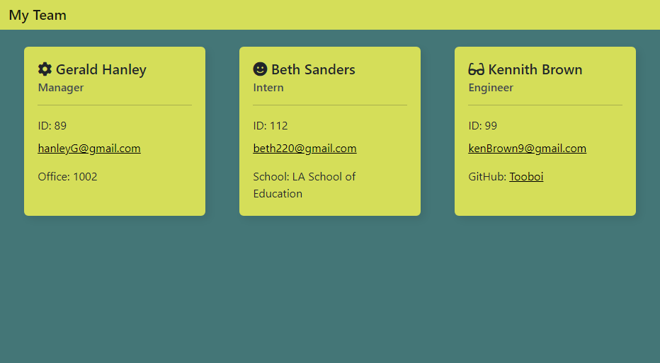

# OOP-Profile-Builder

## Description

Using the bash terminal, you can respond to prompts to build your team composed of a manager, interns, and engineers.

## Table of Contents

If your README is long, add a table of contents to make it easy for users to find what they need.

- [Installation](#installation)
- [Usage](#usage)
- [License](#license)

## Installation

Using your bash terminal:

Check if you have node installed by running code below, this app was built using `v8.1.4`

```
npm -v
```

After you `git clone` , navigate to the folder containing `index.js` and install the node modules with:

```
npm install
```  

## Usage

Once you've opened the app in vscode and installed the node modules run:

```
node index.js
```

You will then be prompted with a series of questions to create your team members.

Once finished with prompts, an `index.html` file will be generated that will look similar to the image below when opened in the browser.



## License

This app is licensed under the [MIT License](./LICENSE)

## How to Contribute

Reach out on [GitHub](https://github.com/Tooboi)

## Tests

To run the tests for this app, make sure you have the node modules installed and then run:

```
npm run test
```

Tests for:

- Proper creation of employees, manager, interns, and engineer
- Methods on each of the previous catagories working properly

Total of 4 test suites with 13 individual tests - all passing
